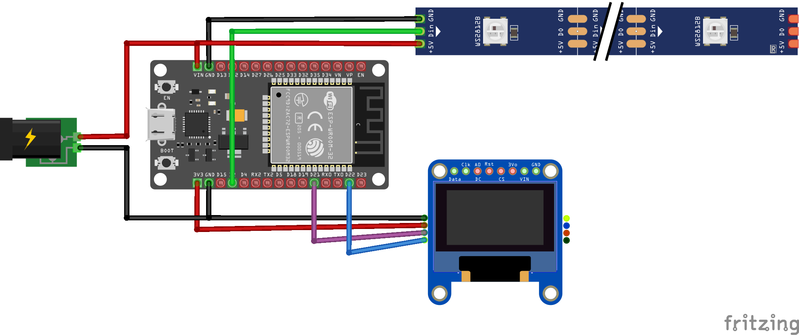
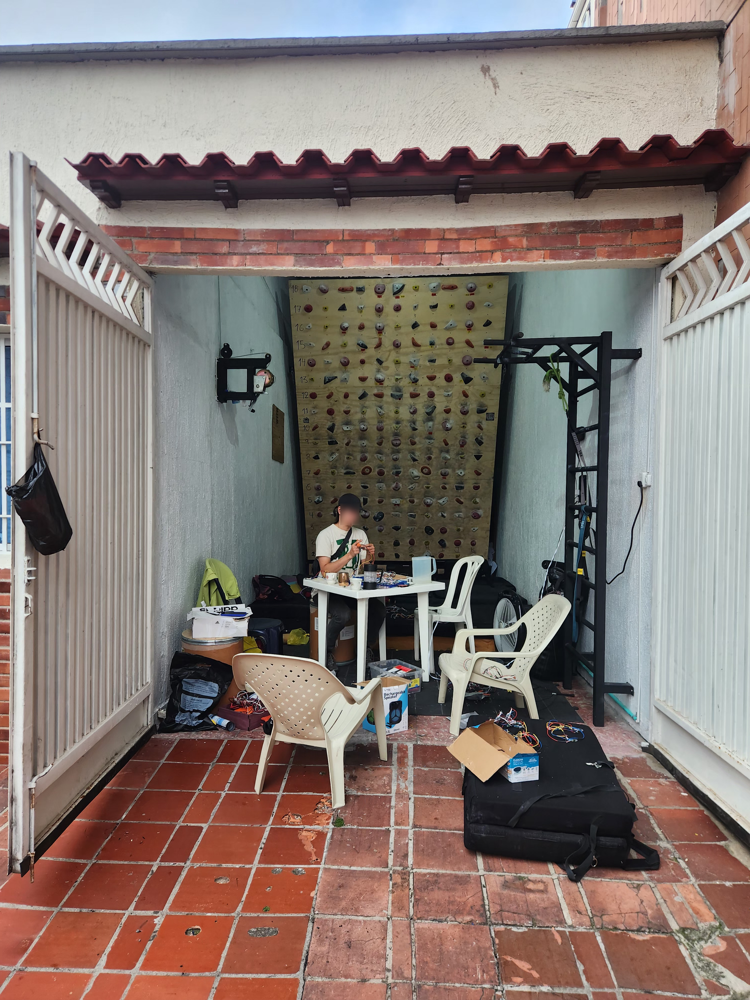
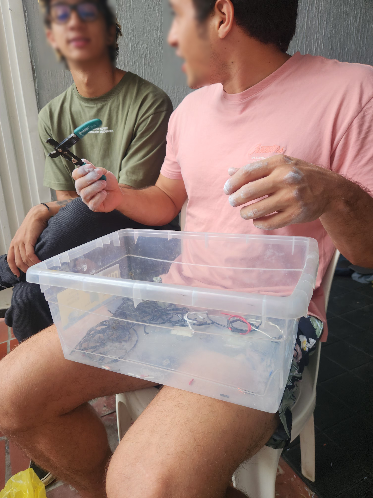
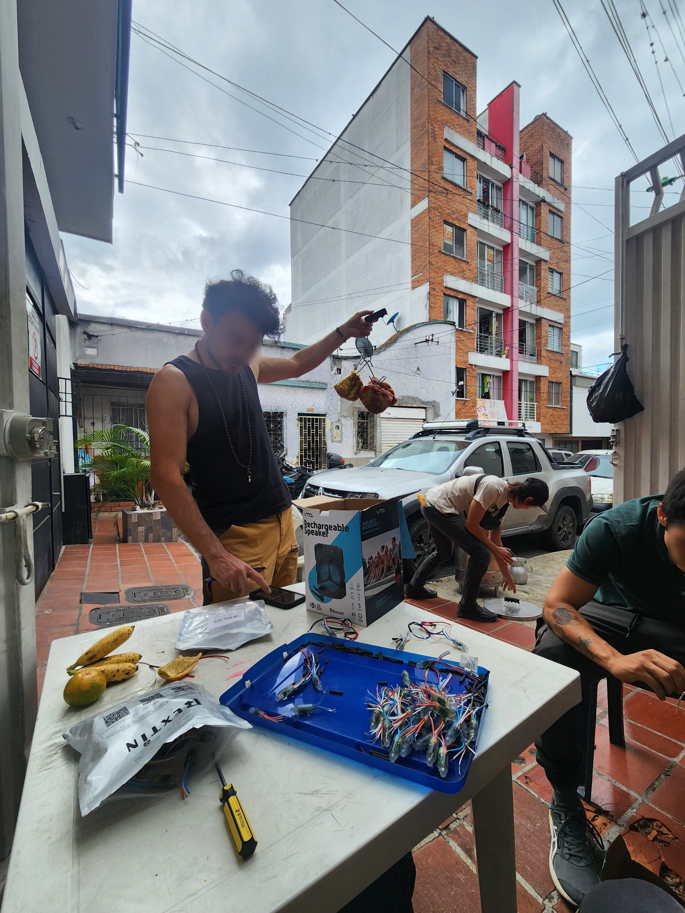
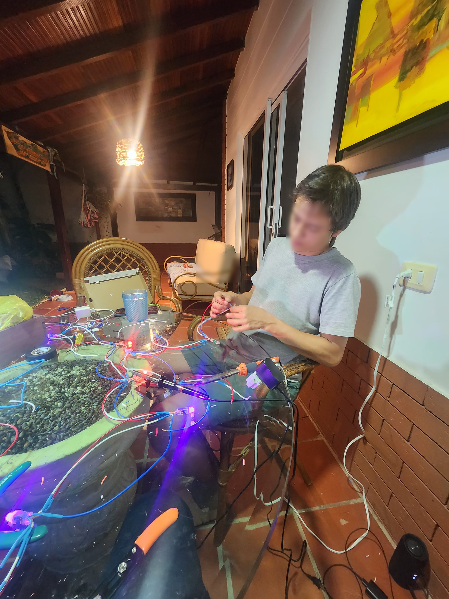

# PROYECTO **CRASH PATH**

Este repositorio nació como un *fork* de [moonboard-esp32-ledble](https://github.com/labs-tibox/moonboard-esp32-ledble), el cual sirvió como punto de partida para nuestro proyecto. ¡Gracias a ese trabajo pudimos comenzar con una base sólida!

Aquí puedes ver nuestra primera [versión de prueba en acción](https://www.instagram.com/reel/DBUzhYKNk9O/?utm_source=ig_web_copy_link&igsh=MzRlODBiNWFlZA==).

---

## 🛠️ Ensamblaje de la MoonBoard

A continuación, compartimos algunas imágenes del proceso de ensamblaje de los LEDs en la MoonBoard:

### 📸 Galería de ensamblaje

1. **Distribución de tiras LED**
   

3. **Conexiones eléctricas -  desactulizadoooo!!**
   
Ignora la pantalla OLED!

4. **Vista general del Proceso**
   
   
   
   
   
   
   
   
   
   
   
   
