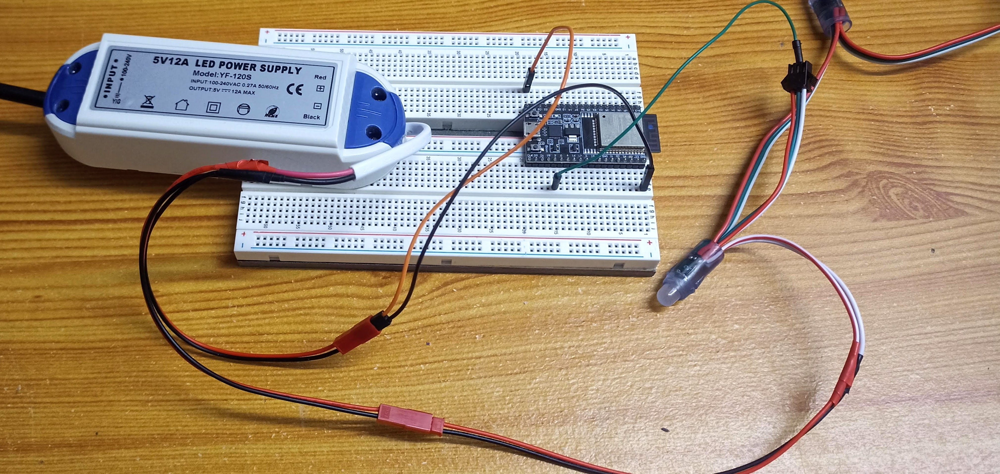
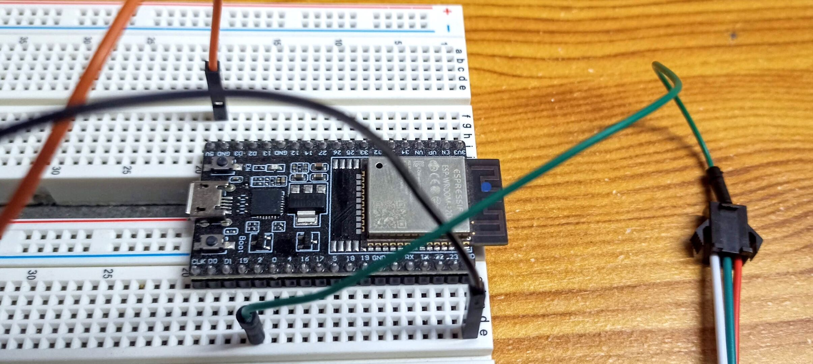
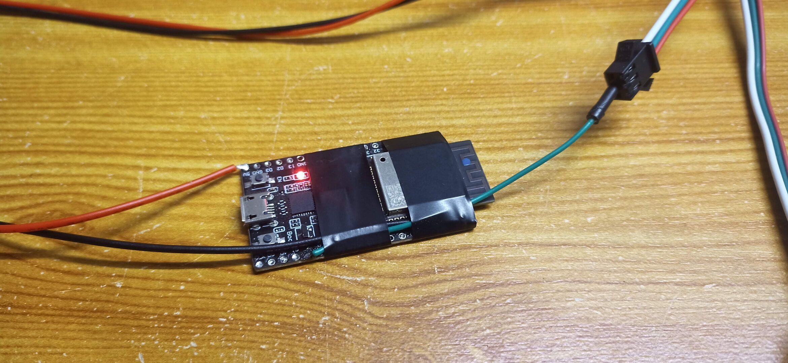

# Un Sistema Sencillo de LEDs BLE para MoonBoard en ESP32

Este proyecto comenzó como un *fork* del excelente proyecto [Moonboard LED en Arduino 33 BLE](https://github.com/FabianRig/ArduinoMoonBoardLED) con el fin de añadir soporte para el chip ESP32. Pero desde entonces, el proyecto ha sido casi completamente reescrito en lo que respecta a las partes de procesamiento de BLE y problemas. Además, las bibliotecas BLE son incompatibles entre los chips Nano 33 BLE y ESP32. ¡Así nació otro proyecto!

Este proyecto tiene como objetivo proporcionar una solución fácil de usar para construir su propio sistema de LEDs MoonBoard. Es compatible tanto con un MoonBoard normal como con el MoonBoard Mini.

Si desea un producto que simplemente funcione, por favor compre el que ofrece Moon Climbing, ¡no es tan caro para el servicio que ofrece y le ahorrará mucho tiempo y energía! Este es un proyecto para personas que disfrutan construyendo cosas por sí mismas y que conocen las desventajas de hacerlo. Este proyecto requerirá algo de trabajo y aún podría no funcionar tan bien como el original. Para ser absolutamente claro: Este proyecto se proporciona "tal cual". No asumo absolutamente ninguna responsabilidad de que funcione como se espera. De hecho, podría dejar de funcionar en cualquier momento. ¡Ha sido advertido!

▶️ [Video de secuencia de prueba de LEDs](doc/leds_setup_sequence.mp4?raw=true)

---

## ℹ️ Requisitos de hardware

Necesitas:
- Una placa de desarrollo **ESP32 Devkit**
- **x4 (50 unidades de WS2811 DC5V)** con 25 cm de longitud de cable (o x8 con 15 cm de longitud de cable y la constante LED_OFFSET configurada en 2)
- Una **fuente de alimentación** adecuada

⚡ Consumo de energía:
- Los **LEDs WS2811** parecen consumir 20mA por cada canal de color, así que a brillo máximo (R: 255, G: 255, B: 255) debería ser (3 * 20mA) = 60mA
- Un **Moonboard estándar** usa 200 LEDs, si todos los LEDs están encendidos en blanco consumirán (200 * 60mA /1000) * 5v = 60 Vatios
- El número máximo de LEDs encendidos es cuando se ejecuta la comprobación de LEDs al arrancar. Encenderá cada LED con los colores rojo, luego verde, luego azul y finalmente violeta. La potencia máxima utilizada es para el color violeta a brillo máximo R y B (255, 0, 255), así que aproximadamente ( 200 * 40mA / 1000 ) * 5v = 40 Vatios. Apuntar a una fuente de alimentación de **60 Vatios** debería ser una buena idea.

🛒 Ejemplos de hardware:
- LEDs [WS2811 5V 15cm](https://www.aliexpress.com/item/33044775305.html) (Aliexpress)
- Fuente de alimentación [Fuente de alimentación 5v 12A 60W](https://www.aliexpress.com/item/4000035882551.html) (Aliexpress)

⚡ Inyección de energía:
- No puedes alimentar todos los LEDs de las tiras solo desde la primera tira, rápidamente notarás una luminosidad débil en los LEDs después de 2 tiras debido a la caída de voltaje.
- La solución es inyectar energía **cada 50 LEDs** (es decir, cada tira) o **cada 100 LEDs** (esta es mi configuración) desde la fuente de alimentación.

---

## 📺 Pantalla (opcional)

### Hardware
 - **Oled 0.96**
 - Resolución: **128x64**
 - Tipo: **SSD1306**

### Conexión de pines
  -  (D)21 => SDA
  -  (D)22 => SCL
  -  3v3 => VCC
  -  GND => GND

### Configuración:
  - La pantalla utilizada tenía la **SCREEN_ADDRESS = 0x3C**
  - Usa el siguiente *sketch* i2cScanner aquí: https://playground.arduino.cc/Main/I2cScanner/

### Conversión de mapa de bits

Solo usa https://javl.github.io/image2cpp/
 - **Invertir colores de imagen = verdadero**
 - **Formato de salida de código = Código Arduino**

### Documentación
 - https://projetsdiy.fr/ssd1306-mini-ecran-oled-i2c-128x64-arduino/
 - https://randomnerdtutorials.com/esp32-ssd1306-oled-display-arduino-ide/

---

## 🔌 Cableado

---

## 🙏 Agradecimientos
Todo el trabajo pesado en este proyecto lo realizan dos impresionantes bibliotecas: [FastLED](https://github.com/FastLED/FastLED) (para la cadena de LEDs) y [BLESerial](https://github.com/James-NZ/BLESerial) (para la funcionalidad BLE en ESP32). Hacen posible que este proyecto sea bastante corto, fácil de entender y fácil de mantener.

Gracias a los dos siguientes proyectos por la inspiración y por demostrar que este tipo de proyecto era fácilmente realizable en un chip Arduino:
- [Sistema de LEDs Moonboard en Arduino NRF52](https://github.com/e-sr/moonboard_nrf52)
- [LED Moonboard en Arduino 33 BLE](https://github.com/FabianRig/ArduinoMoonBoardLED)

---

## ✨ Cómo usar
1. Descarga e instala **Visual Studio Code**.
2. Instala **PlatformIO** en Visual Studio Code.
3. Descarga y abre este proyecto.
4. Ajusta a tus necesidades (tipo de Moonboard, *offset* de LEDs, pin de LEDs) en el archivo `config.h`.
5. Compila y flashea a un **ESP32**.
6. ¡Usa la **aplicación MoonBoard** para conectarte al ESP32 y mostrar los problemas en tu tabla!

---

## 🚦 Mapeo de LEDs
El patrón de cableado de LEDs más común (aquí para un MoonBoard estándar) es el siguiente (vista frontal):
- Empieza **abajo a la izquierda (A1)**,
- **Sube por la columna (hasta A18)**,
- Una columna a la derecha (hasta B18),
- **Todo el camino hacia abajo (hasta B1)**,
- Una columna a la derecha (hasta C1),
- Y repite.

La aplicación MoonBoard codifica los agarres de la misma manera. El agarre A1 es 0, el agarre A2 es 1, el agarre A3 es 2 y así sucesivamente.

---

## 💡 Es bueno saber
- **Cableado**: Generalmente, el blanco es GND/negativo, el rojo es positivo, el verde es datos. ¡Por favor, verifica dos veces! ¡Podría ser una buena idea usar una resistencia (por ejemplo, **330 ohmios**) en la línea de datos!
- ¡**Nunca alimentes el ESP32 solo cuando está conectado a la cadena de LEDs sin alimentar la cadena de LEDs**! ¡Esto podría destruir el primer LED!
- No es necesario apagar el ESP32, ¡simplemente puedes **desconectar la fuente de alimentación**! Esto es (al menos para mí) una gran mejora en comparación con una solución basada en Raspberry Pi.

---

## 📷 Imágenes

### ESP32 en una protoboard

### ESP32 soldado directamente

### ESP32 y todas las tiras de LEDs listas para la instalación
